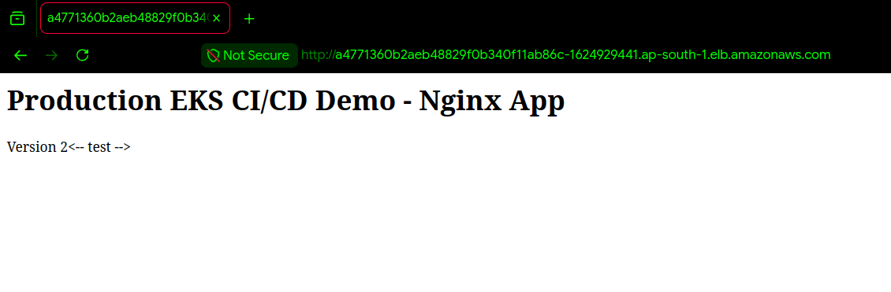
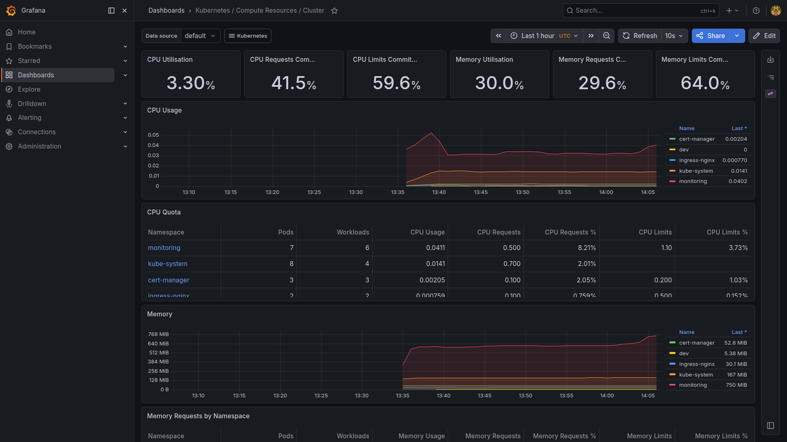
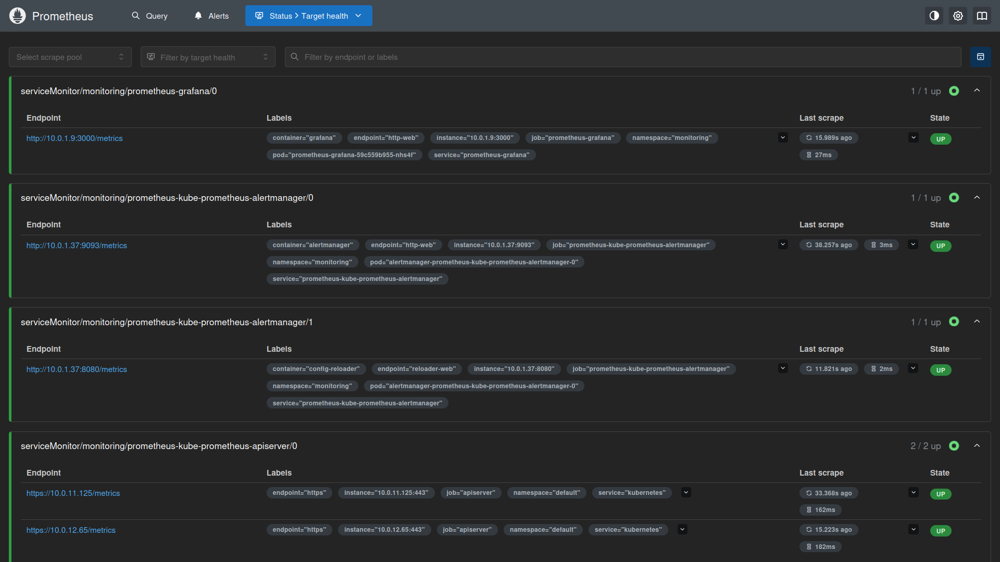
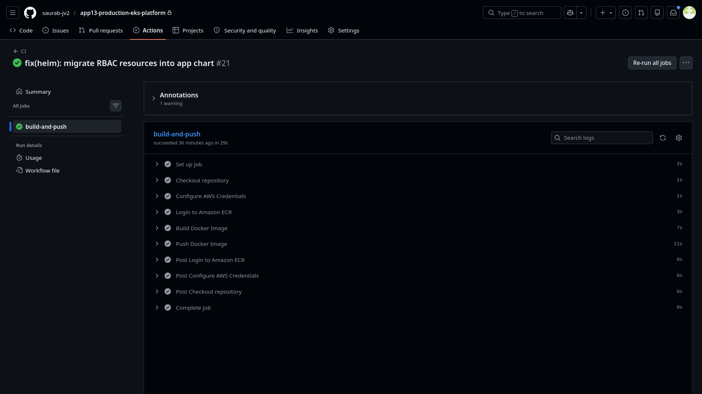
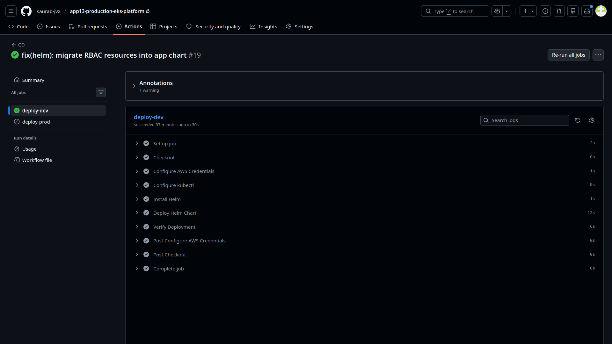

# App13 Production EKS Platform

## Overview

App13 Production EKS Platform is a production-style Kubernetes platform built on Amazon EKS using Infrastructure as Code, GitHub Actions CI/CD, Helm, Prometheus, Grafana, and cert-manager.

The project demonstrates end-to-end platform engineering practices including infrastructure provisioning, container image delivery, Kubernetes deployment automation, ingress management, monitoring, and secure AWS authentication using GitHub OIDC.

---

## Key Features

* Amazon EKS based Kubernetes platform
* Infrastructure as Code using Terraform
* Modular Terraform architecture
* GitHub Actions CI/CD automation
* GitHub OIDC authentication
* Amazon ECR container registry
* Helm-based application deployments
* Ingress NGINX controller
* Prometheus monitoring
* Grafana dashboards
* cert-manager TLS automation
* Multi-environment Terraform structure
* Production-style repository organization

---

## Technology Stack

### Cloud

* AWS
* Amazon EKS
* Amazon ECR
* IAM
* VPC
* NAT Gateway

### Infrastructure as Code

* Terraform

### Containerization

* Docker

### Kubernetes

* Kubernetes
* Helm
* Ingress NGINX
* cert-manager

### Monitoring

* Prometheus
* Grafana

### CI/CD

* GitHub Actions
* GitHub OIDC

---

## Architecture

The platform consists of four major layers:

### Infrastructure Layer

* VPC
* Public Subnets
* Private Subnets
* NAT Gateway
* IAM
* Amazon EKS
* Amazon ECR

### Platform Services Layer

* Ingress NGINX
* Prometheus
* Grafana
* cert-manager

### Application Layer

* NGINX Application
* Helm Chart
* Kubernetes Services
* Ingress Resources

### Automation Layer

* GitHub Actions
* GitHub OIDC
* CI Pipeline
* CD Pipeline
* Platform Deployment Workflow

---

## Repository Structure

```text
.
├── .github/
├── app/
├── docs/
├── helm/
├── kubernetes/
├── scripts/
├── screenshots/
└── terraform/
```

Detailed repository documentation:

```text
docs/repository-structure.md
```

---

## Documentation

### Architecture

* docs/architecture/architecture-overview.md
* docs/architecture/network-architecture.md
* docs/architecture/cicd-architecture.md
* docs/architecture/kubernetes-architecture.md
* docs/architecture/monitoring-architecture.md

### Operations

* docs/deployment-guide.md
* docs/security.md
* docs/repository-structure.md

---

## CI/CD Workflows

### CI Workflow

Responsible for:

* Docker image build
* Amazon ECR image publishing

### CD Workflow

Responsible for:

* Kubernetes deployment
* Helm upgrades
* Amazon EKS application delivery

### Platform Workflow

Responsible for:

* Ingress NGINX installation
* Prometheus installation
* Grafana installation
* cert-manager installation

---

## Security

Implemented security controls:

* GitHub OIDC authentication
* AWS IAM role assumption
* Private Kubernetes worker nodes
* TLS certificate automation
* Kubernetes secret management
* Network isolation through VPC design

Future enhancements:

* Kubernetes RBAC
* Network policy enforcement
* External secrets integration

---

## Monitoring

The platform uses:

* Prometheus for metrics collection
* Grafana for dashboard visualization

Monitored resources:

* Kubernetes cluster
* Worker nodes
* Pods
* Deployments
* Services
* Application workloads

---

## Deployment

Refer to:

```text
docs/deployment-guide.md
```

for complete deployment instructions.

---

## Screenshots

Project screenshots are stored in:

```text
screenshots/
```

Examples include:

## Deployment Evidence

### Application



### Grafana Dashboard



### Prometheus Targets



### CI Pipeline



### CD Pipeline



---

## Learning Outcomes

This project demonstrates practical experience with:

* AWS Infrastructure
* Kubernetes Operations
* Terraform
* Helm
* GitHub Actions
* GitHub OIDC
* CI/CD Automation
* Platform Engineering
* Monitoring and Observability
* Production-style Cloud Architecture

---

## Future Improvements

* Kubernetes RBAC implementation
* Network policies
* Automated TLS issuance
* Multi-environment deployment promotion
* Disaster recovery automation
* Alerting integration

---

## Author

Saurabh Jadhav

DevOps / Cloud / Platform Engineering Project
GitHub: https://github.com/saurab-jv2

