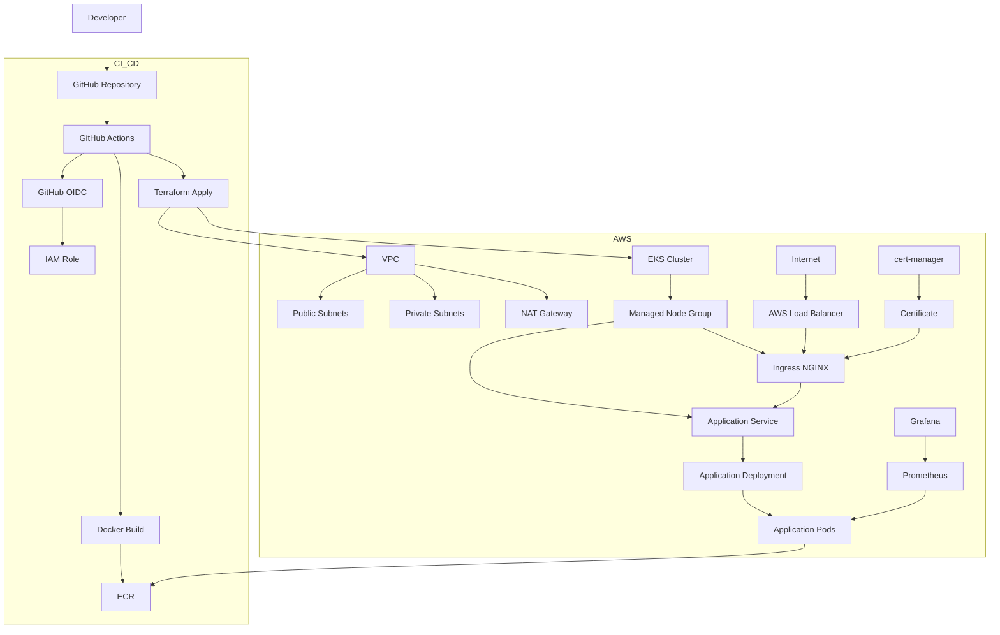

# App13 Production EKS Platform Architecture

## Overview

This document describes the complete infrastructure, CI/CD pipeline, Kubernetes deployment workflow, and observability stack used by App13.

## Architecture Diagram

## Components

### GitHub Repository

Stores all source code, infrastructure code, Kubernetes manifests, Helm charts, and GitHub Actions workflows. Acts as the single source of truth for the platform.

### GitHub Actions

Automates infrastructure provisioning and application deployment workflows. Executes Terraform operations, builds container images, pushes images to Amazon ECR, and deploys workloads to Amazon EKS.

### GitHub OIDC

Provides secure authentication between GitHub Actions and AWS without using long-lived AWS access keys. GitHub Actions assumes AWS IAM roles through OpenID Connect (OIDC).

### Terraform

Infrastructure as Code (IaC) tool used to provision and manage AWS resources, including networking, IAM roles, EKS, and supporting infrastructure.

### Amazon VPC

Provides network isolation for the platform and contains public and private subnets used by the EKS cluster and related AWS resources.

### Public Subnets

Host internet-facing resources such as load balancers and provide external connectivity to the platform.

### Private Subnets

Host Kubernetes worker nodes and application workloads, preventing direct internet exposure.

### NAT Gateway

Allows resources in private subnets to access the internet for updates, package downloads, and image retrieval while remaining inaccessible from external networks.

### Amazon EKS

Managed Kubernetes service used to orchestrate, scale, and operate containerized applications.

### Managed Node Group

Provides EC2 worker nodes managed by EKS. Hosts application pods and cluster services.

### Amazon ECR

Container registry used to store Docker images built by the CI/CD pipeline.

### Kubernetes Deployment

Defines the desired state of application workloads, including replica count, update strategy, and container specifications.

### Application Pods

Running instances of the application managed by Kubernetes Deployments.

### Kubernetes Service

Provides stable networking and service discovery for application pods within the cluster.

### Ingress NGINX Controller

Acts as the cluster ingress layer, routing external HTTP/HTTPS traffic to internal Kubernetes services.

### AWS Load Balancer

Provides external access to the Kubernetes cluster and forwards traffic to the Ingress NGINX Controller.

### cert-manager

Automates certificate issuance, renewal, and management within Kubernetes.

### Certificate Resources

Kubernetes resources generated and managed by cert-manager to provide TLS encryption for ingress traffic.

### Prometheus

Collects and stores metrics from Kubernetes components, nodes, and application workloads for monitoring and alerting purposes.

### Grafana

Visualizes metrics collected by Prometheus through dashboards used for platform monitoring and operational visibility.

### Application

Containerized web application deployed on Amazon EKS and exposed through Kubernetes networking and ingress components.
