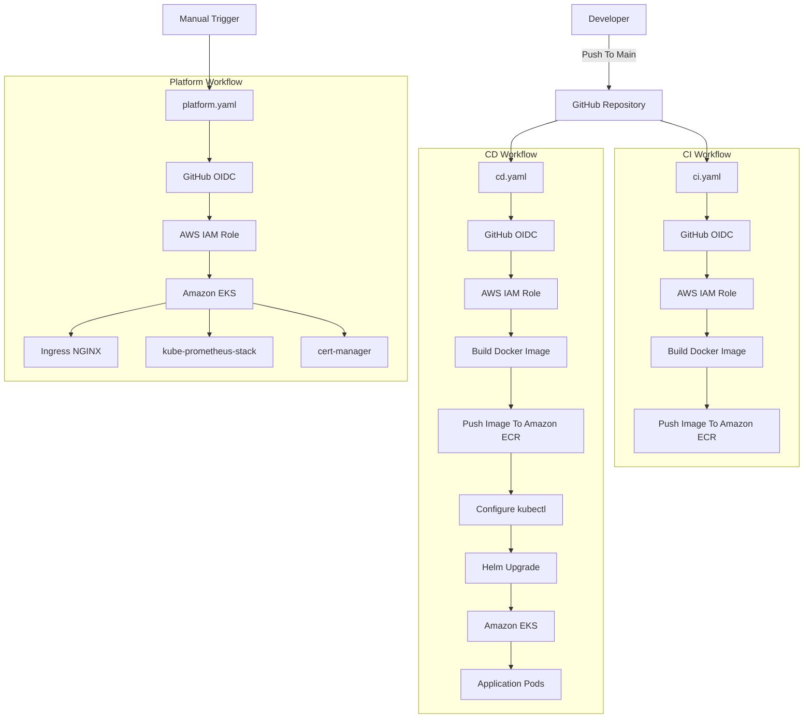
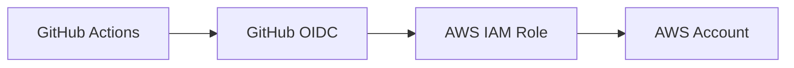
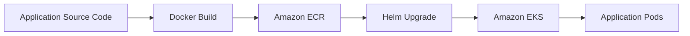
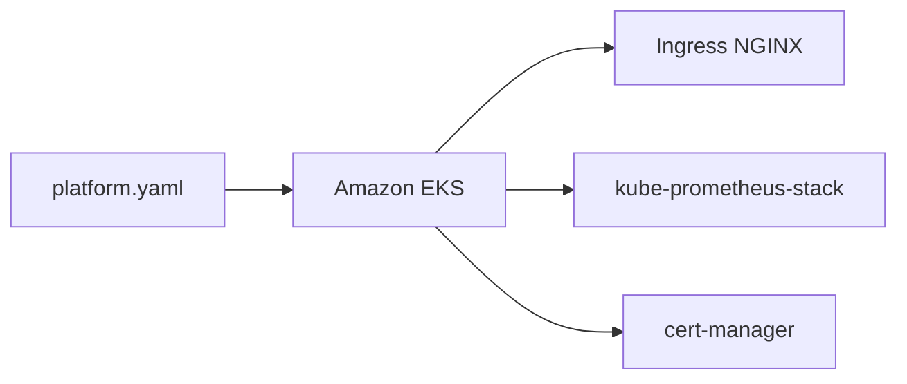

# CI/CD Architecture

## Overview

This document describes the GitHub Actions workflows used by the App13 Production EKS Platform.

The platform uses GitHub Actions and GitHub OIDC authentication to automate container image delivery, Kubernetes application deployment, and cluster service installation.

The repository contains three workflows:

* ci.yaml
* cd.yaml
* platform.yaml

## Workflow Architecture



---

## Workflow Responsibilities

### ci.yaml

Continuous Integration workflow triggered on pushes to the main branch.

Responsibilities:

* Authenticate to AWS using GitHub OIDC
* Login to Amazon ECR
* Build application Docker image
* Push versioned image to Amazon ECR
* Push latest image to Amazon ECR

---

### cd.yaml

Continuous Deployment workflow triggered on pushes to the main branch.

Responsibilities:

* Authenticate to AWS using GitHub OIDC
* Login to Amazon ECR
* Build application Docker image
* Push image to Amazon ECR
* Configure kubectl access
* Connect to Amazon EKS
* Deploy application using Helm

---

### platform.yaml

Platform services installation workflow triggered manually.

Responsibilities:

* Authenticate to AWS using GitHub OIDC
* Configure kubectl access
* Verify EKS connectivity
* Install Ingress NGINX
* Install kube-prometheus-stack
* Create Grafana administrator credentials
* Install cert-manager
* Verify platform components

---

## Authentication Architecture



GitHub Actions authenticates to AWS using OpenID Connect (OIDC).

Benefits:

* No long-lived AWS access keys
* Short-lived credentials
* Improved security
* Centralized IAM management

---

## Application Deployment Flow



---

## Platform Services Installation Flow



---

## Core Components

### GitHub Actions

Executes automation workflows.

### GitHub OIDC

Provides secure AWS authentication.

### AWS IAM Role

Allows GitHub Actions to interact with AWS resources.

### Amazon ECR

Stores application container images.

### Helm

Deploys and upgrades Kubernetes workloads.

### Amazon EKS

Hosts application and platform services.

### Ingress NGINX

Provides ingress traffic routing.

### kube-prometheus-stack

Provides monitoring and observability capabilities.

### cert-manager

Provides certificate lifecycle management.

---

## Benefits

* Automated container image delivery
* Automated Kubernetes deployments
* Secure AWS authentication using OIDC
* Repeatable platform installation
* Version-controlled deployment workflows
* Consistent Helm-based application delivery

```
```
