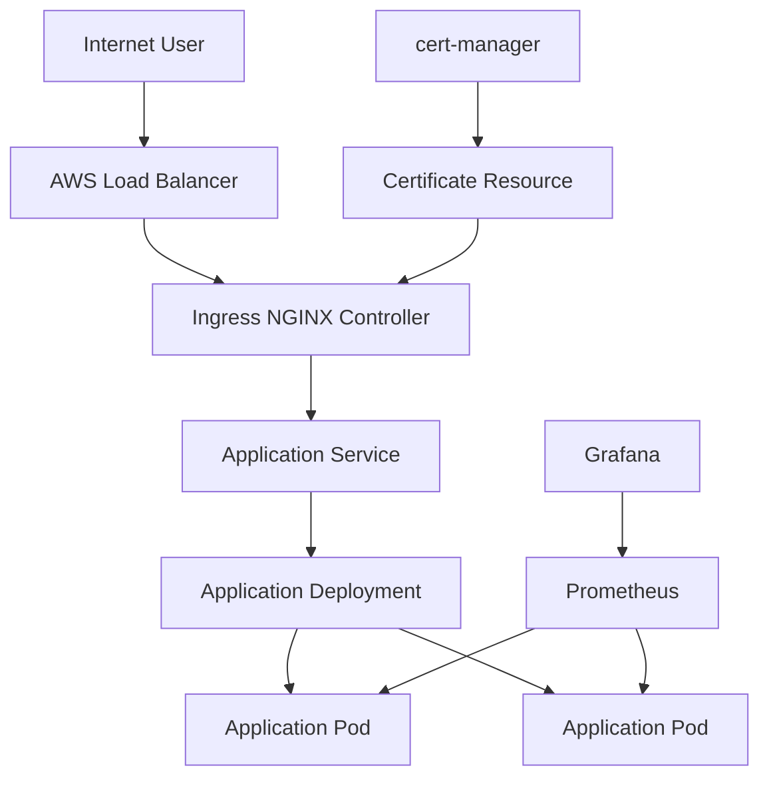

# Kubernetes Architecture

## Overview

This document describes the Kubernetes runtime architecture used by the App13 Production EKS Platform.

The platform runs on Amazon EKS and uses Kubernetes Deployments, Services, Ingress NGINX, cert-manager, Prometheus, and Grafana to provide application delivery, traffic routing, security, and observability.

## Kubernetes Architecture Diagram



## Request Flow

### Step 1

A user sends an HTTP or HTTPS request to the application endpoint.

### Step 2

The AWS Load Balancer receives the request and forwards traffic to the Ingress NGINX Controller.

### Step 3

The Ingress resource applies routing rules and forwards the request to the appropriate Kubernetes Service.

### Step 4

The Kubernetes Service load-balances traffic across available application pods.

### Step 5

The application pod processes the request and returns a response to the user.

## Core Components

### Amazon EKS

Managed Kubernetes control plane responsible for cluster orchestration and lifecycle management.

### Deployment

Maintains the desired number of application replicas and manages rolling updates.

Responsibilities:

* Pod creation
* Replica management
* Rolling updates
* Self-healing

### Application Pods

Containerized application instances running on Kubernetes worker nodes.

Responsibilities:

* Serve application traffic
* Execute application workloads
* Expose metrics for monitoring

### Service

Provides a stable internal endpoint for application pods.

Responsibilities:

* Service discovery
* Internal load balancing
* Pod abstraction

### Ingress NGINX Controller

Acts as the cluster ingress layer.

Responsibilities:

* HTTP routing
* HTTPS termination
* Traffic forwarding
* Host-based routing
* Path-based routing

### AWS Load Balancer

Provides external access to the Kubernetes cluster.

Responsibilities:

* Internet-facing endpoint
* Traffic distribution
* Integration with Kubernetes services

## TLS Management

### cert-manager

Automates certificate lifecycle management.

Responsibilities:

* Certificate issuance
* Certificate renewal
* Certificate monitoring

### Certificate Resource

Stores and manages TLS certificates consumed by Ingress resources.

## Monitoring Stack

### Prometheus

Collects metrics from Kubernetes workloads and cluster components.

Metrics include:

* Pod health
* Resource utilization
* Application metrics
* Cluster metrics

### Grafana

Provides visualization dashboards for platform monitoring.

Dashboards include:

* Cluster health
* Node metrics
* Pod metrics
* Application performance

## High Availability

The platform is designed for resilience through:

* Multiple application replicas
* Kubernetes self-healing
* Automatic pod rescheduling
* Service-based load balancing
* Rolling deployment strategy

## Operational Benefits

* Automated workload recovery
* Horizontal scalability
* Centralized monitoring
* Secure traffic routing
* Automated certificate management
* Declarative application deployment

```
```
