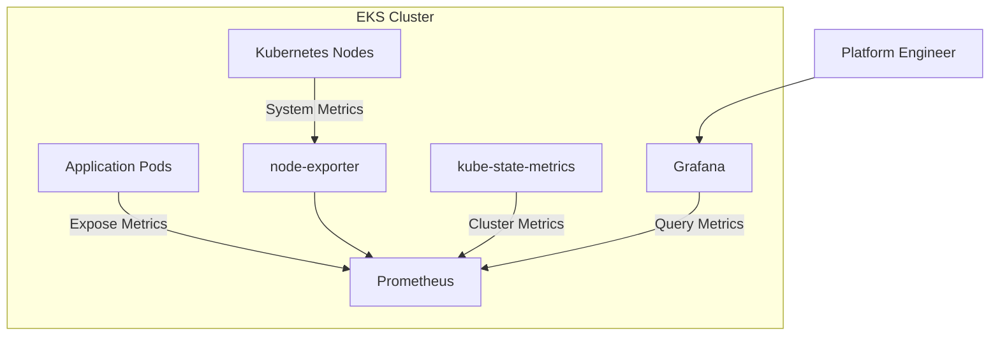

# Monitoring Architecture

## Overview

This document describes the monitoring and observability architecture used by the App13 Production EKS Platform.

The monitoring stack is deployed inside Kubernetes and provides visibility into cluster health, node performance, pod status, and application metrics.

The platform uses Prometheus for metrics collection and Grafana for visualization.

## Monitoring Architecture Diagram



## Monitoring Flow

### Step 1

Application workloads expose metrics endpoints.

### Step 2

node-exporter collects operating system and node-level metrics.

### Step 3

kube-state-metrics exposes Kubernetes object metrics.

### Step 4

Prometheus periodically scrapes all configured targets.

### Step 5

Prometheus stores collected metrics in its time-series database.

### Step 6

Grafana queries Prometheus and renders dashboards.

## Components

### Prometheus

Central metrics collection and storage system.

Responsibilities:

* Metrics scraping
* Metrics storage
* Service discovery
* Time-series database

### Grafana

Visualization platform used to build operational dashboards.

Responsibilities:

* Dashboard creation
* Metric visualization
* Cluster monitoring
* Performance analysis

### node-exporter

Collects node-level metrics from Kubernetes worker nodes.

Metrics include:

* CPU usage
* Memory utilization
* Disk usage
* Network statistics
* Load averages

### kube-state-metrics

Exposes Kubernetes resource metrics.

Metrics include:

* Pod status
* Deployment status
* Replica counts
* Namespace metrics
* Node status

### Application Pods

Expose application-specific metrics for monitoring and troubleshooting.

## Metrics Sources

### Infrastructure Metrics

Collected from:

* Worker nodes
* Kubernetes control plane integrations
* Cluster services

### Kubernetes Metrics

Collected from:

* Deployments
* Pods
* Services
* Nodes
* Namespaces

### Application Metrics

Collected directly from application workloads.

## Operational Benefits

* Real-time cluster visibility
* Infrastructure health monitoring
* Kubernetes resource monitoring
* Performance troubleshooting
* Capacity planning
* Faster incident investigation

## Dashboards

Typical Grafana dashboards include:

* Kubernetes Cluster Overview
* Node Resource Utilization
* Pod Health Status
* Namespace Resource Consumption
* Application Performance Metrics

```
```
