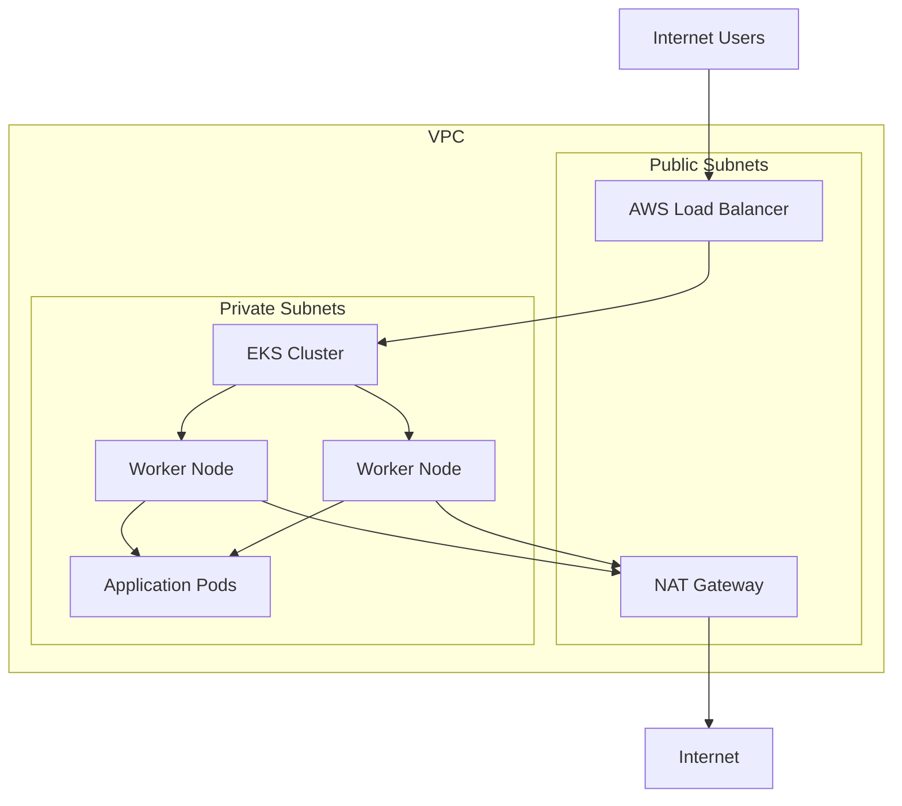

# Network Architecture

## Overview

This document describes the networking architecture used by the App13 Production EKS Platform.

The platform is deployed inside a dedicated Amazon VPC consisting of public and private subnets. Public-facing traffic enters through an AWS Load Balancer and is routed to workloads running inside Amazon EKS.

## Network Architecture Diagram



## Components

### VPC

Provides isolated networking for the platform.

### Public Subnets

Host internet-facing resources including the AWS Load Balancer and NAT Gateway.

### Private Subnets

Host Kubernetes worker nodes and application workloads.

### AWS Load Balancer

Receives inbound HTTP/HTTPS traffic from users and forwards requests into the Kubernetes cluster.

### NAT Gateway

Allows resources in private subnets to access the internet without exposing them directly.

### Amazon EKS

Managed Kubernetes control plane.

### Worker Nodes

EC2 instances managed by EKS that run Kubernetes workloads.

### Application Pods

Containerized application instances deployed on worker nodes.

## Traffic Flow

1. User sends request from the internet.
2. AWS Load Balancer receives the request.
3. Traffic is forwarded into the EKS cluster.
4. Kubernetes routes traffic to application pods.
5. Application responds to the user.
6. Worker nodes use the NAT Gateway for outbound internet access when required.

## Security Design

* Application workloads run inside private subnets.
* No direct internet access to worker nodes.
* Inbound traffic is controlled through load balancer security groups.
* Outbound traffic from private subnets is routed through the NAT Gateway.
* AWS IAM and Kubernetes RBAC control access to cluster resources.

```
```
