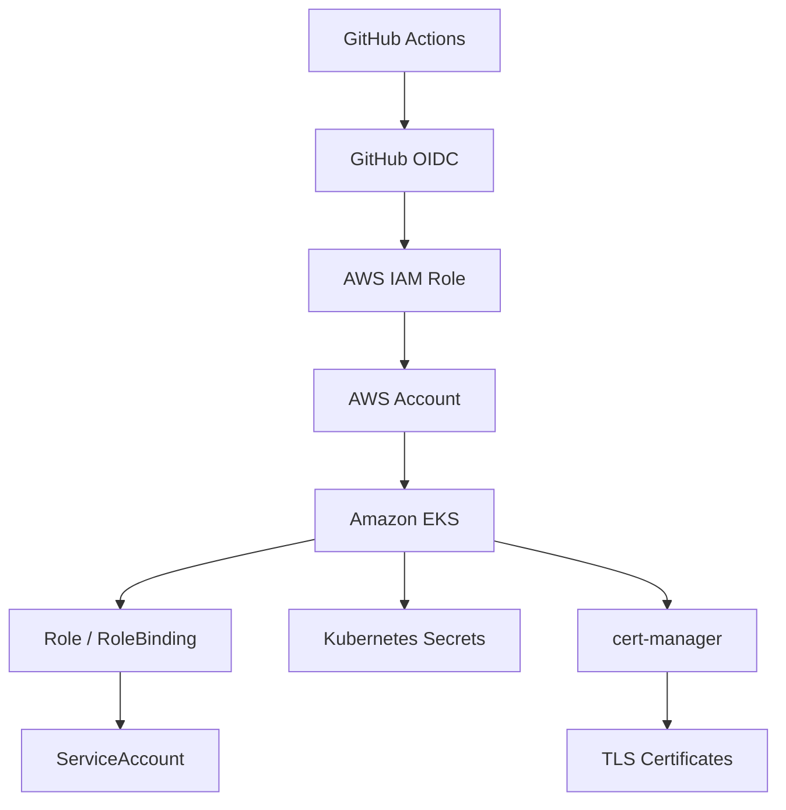

# Security Architecture

## Overview

This document describes the security controls implemented in the App13 Production EKS Platform.

The platform follows cloud-native security practices including identity-based authentication, private networking, secret management, encrypted communication, and infrastructure isolation.

---

## Security Architecture Diagram

---

## Identity and Access Management

### GitHub OIDC Authentication

The platform uses GitHub OpenID Connect (OIDC) to authenticate GitHub Actions with AWS.

Authentication Flow:

1. GitHub Actions requests an OIDC token.
2. AWS validates the token.
3. IAM allows role assumption.
4. Temporary AWS credentials are issued.
5. Workflow performs AWS operations.

Benefits:

* No static AWS access keys
* Short-lived credentials
* Reduced credential exposure
* Centralized access control

---

### AWS IAM Roles

GitHub Actions assumes AWS IAM roles to perform deployment operations.

Permissions are granted through IAM policies rather than long-lived user credentials.

Responsibilities include:

* Amazon ECR access
* Amazon EKS access
* Infrastructure management
* Deployment automation

Security principles:

* Least privilege access
* Temporary credentials
* Role-based authorization

---

## Network Security

### VPC Isolation

The platform runs inside a dedicated Amazon VPC.

Benefits:

* Isolated networking
* Controlled communication boundaries
* Improved security posture

---

### Public and Private Subnets

Public Subnets:

* AWS Load Balancer
* NAT Gateway

Private Subnets:

* EKS Worker Nodes
* Application Pods
* Platform Services

Benefits:

* No direct internet access to workloads
* Reduced attack surface
* Controlled outbound connectivity

---

### Security Groups

Security groups control inbound and outbound traffic between AWS resources.

Used to secure:

* EKS Cluster
* Worker Nodes
* Load Balancers

---

## Kubernetes Security

### Namespace Isolation

Dedicated namespaces are used to separate workloads and platform services.

Namespaces used:

* dev
* ingress-nginx
* monitoring
* cert-manager

Benefits:

* Logical separation of workloads
* Reduced operational risk
* Easier resource management

---

### Kubernetes Secrets

Sensitive values are stored as Kubernetes Secrets.

Examples:

* Grafana administrator credentials
* TLS-related data
* Application configuration values

Benefits:

* Centralized secret storage
* Reduced hardcoded credentials
* Easier secret rotation

---

## Kubernetes RBAC

The platform implements Kubernetes Role-Based Access Control (RBAC) to enforce least-privilege access for application workloads.

RBAC resources include:

* ServiceAccount
* Role
* RoleBinding

The application is deployed using a dedicated Kubernetes ServiceAccount rather than the default service account.

### ServiceAccount

Provides a dedicated workload identity for application pods.

Benefits:

* Workload isolation
* Controlled permissions
* Improved security posture

### Role

Defines the Kubernetes API permissions granted to the application.

Permissions are restricted to only the resources required by the workload.

### RoleBinding

Associates the ServiceAccount with the Role and grants the defined permissions within the namespace.

### Security Benefits

* Principle of least privilege
* Reduced attack surface
* Controlled Kubernetes API access
* Better workload isolation
* Production-oriented security design

---

## TLS Security

### cert-manager

cert-manager automates certificate lifecycle management within Kubernetes.

Responsibilities:

* Certificate issuance
* Certificate renewal
* Certificate rotation

Benefits:

* Automated TLS management
* Reduced operational effort
* Improved application security

---

### TLS Certificates

TLS certificates are used to secure communication between clients and platform services.

Benefits:

* Encrypted traffic
* Improved confidentiality
* Protection against interception attacks

---

## Container Security

### Amazon ECR

Container images are stored in Amazon ECR.

Benefits:

* Centralized image storage
* Versioned image management
* Controlled image distribution

---

### Immutable Deployments

Application releases are deployed using versioned container images.

Benefits:

* Consistent deployments
* Reproducible environments
* Easier rollback strategy

---

## Security Best Practices

Implemented:

* GitHub OIDC authentication
* IAM role assumption
* Private worker nodes
* Namespace isolation
* Kubernetes Secrets
* TLS certificate automation
* Infrastructure as Code
* Version-controlled deployments

Planned:

* Kubernetes RBAC
* Network Policies
* External Secrets integration
* Advanced workload security controls

---

## Security Summary

The App13 Production EKS Platform implements multiple layers of security across identity, networking, Kubernetes, and deployment automation.

Key security controls include:

* GitHub OIDC
* AWS IAM Roles
* VPC Isolation
* Private Subnets
* Kubernetes Secrets
* cert-manager
* TLS Encryption
* Namespace Isolation

These controls provide a secure foundation for operating workloads on Amazon EKS while maintaining automation and operational simplicity.
